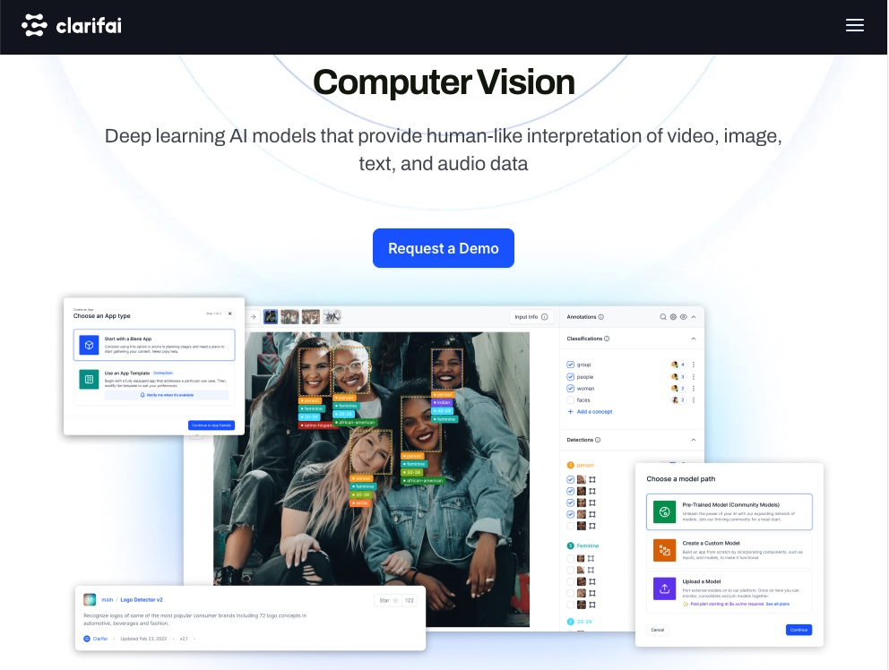
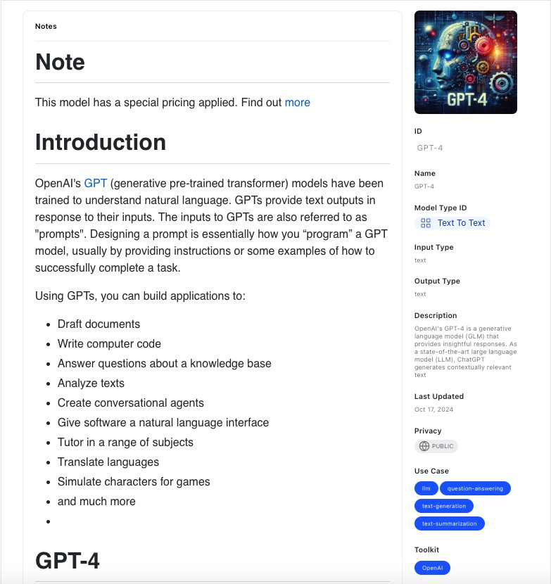

## Hi, this is my Smart Brain for Color theme detection, face-recognition
## Live server: https://ai-recognition-frontend.onrender.com/

<h2>React</h2>

<br/>

<h3>Clarifai provides an end-to-end Full Stack enterprise AI platform to build AI faster</h3>
<h3>Leveraging modern AI technologies like Large Language Modesl (LLM), Generative AI, Retrieval Augmented Genration (RAG), data labeling, inference</h3>


<h3>You man find out more AI models on</h3>
<h3>https://clarifai.com/clarifai/main/models/</h3>
<br/>
<h3>Clarifai offers Face Detection models :D</h3>

<br/>
<h3>Clarifai now offers GPT-4 model too :D</h3>

<br/>

<h3>To download this React app:</h3>

```bash
git clone https://github.com/PhoenixYork166/AI-Recognition-React-localStorage.git;
```

<h3>To install React app dependencies</h3>

```bash
cd AI-Recognition-React-localStorage;
npm install;
```

<h3>To run this app locally</h3>

```bash
npm start;
```
<h3>To run along with Backend Node.js</h3>

```bash
git clone https://github.com/PhoenixYork166/AI-Recognition-Nodejs-localStorage.git;
```

<h3>To install Node dependencies</h3>

```bash
cd AI-Recognition-Nodejs-localStorage;
npm install;
```

<h3>To run Node backend on another terminal</h3>

```bash
npm start;
```